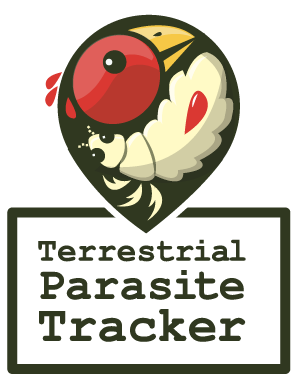

# logo
Logos for [Terrestrial Parasite Tracker](https://parasitetracker.org) project were designed by Branden Apitz. 

If you open the .pdf logo file in Adobe Illustrator or similar software you can access three different styles of the logo (wide, tall, or no text). Also attached are .png of each in case you want to use them on a presentation or lab webpage.

 | link / image |
 | --- |
 | [TPTlogo.pdf](TPTlogo.pdf) |
 |  |
 |  |
 |  |
